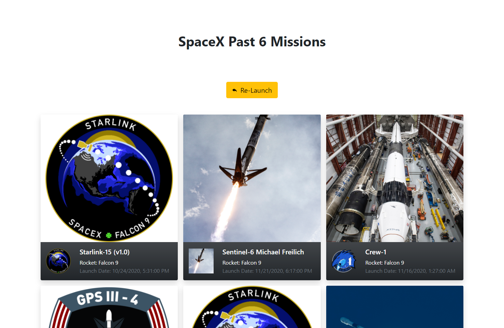
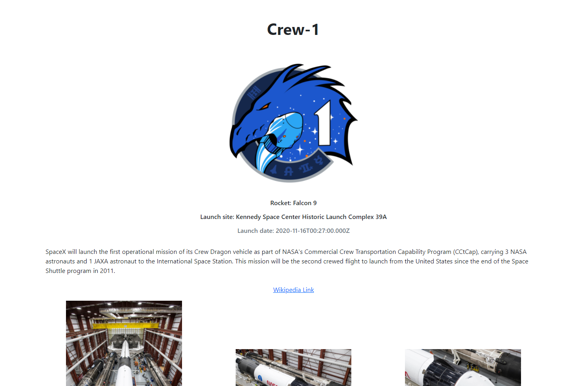

# SpaceX Launches

 

  
   

  

 

A frontend written in Vue using the public SpaceX GraphQL API to display past missions.

The initial query displays a responsive overview of past missions:

Clicking on the cards reveals details for each mission:

